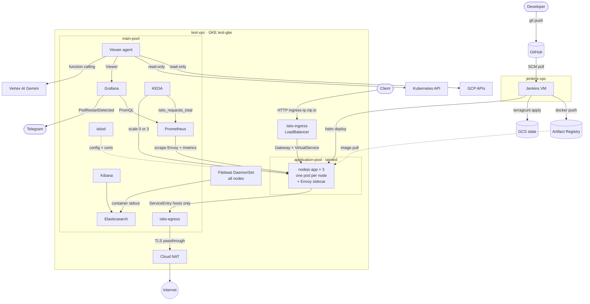
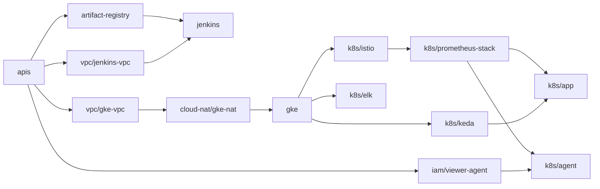

# GKE Platform

A GKE-based platform defined entirely as code with Terragrunt, Terraform and Helm. It runs a sample Node.js service behind Istio, collects metrics with Prometheus and Grafana, scales the service to zero with KEDA when it is idle, ships container logs to ELK and includes a read-only AI agent that can answer questions about the environment. Jenkins, running on its own VM, builds and deploys everything.

## Architecture



### How the pieces fit together

- **Networking.** Jenkins and GKE each have their own VPC. The Jenkins firewall allows SSH and port 8080 only from the addresses listed in `allowed_cidrs`. Both GKE node pools use private nodes (`enable_private_nodes`), so nodes have only internal IPs and reach the internet through Cloud NAT in `test-vpc`. Google APIs and Artifact Registry are reached through Private Google Access on the subnet. The control plane keeps its public endpoint, so Jenkins and operators can still run `kubectl`.
- **Node pools.** `main-pool` runs the platform components. `application-pool` has a `dedicated=application:NoSchedule` taint, so only the Node.js service, which tolerates the taint, is scheduled there. Required pod anti-affinity places each application pod on a different node.
- **Traffic.** Requests reach the `istio-ingress` LoadBalancer and are routed to the service by an Istio `Gateway` and `VirtualService`. The gateway accepts only the `<ingress-ip>.nip.io` host. Requests to the bare IP get a 404, so internet scanners are not counted as traffic and don't keep the service awake.
- **Egress.** A `Sidecar` resource puts the `apps` namespace in `REGISTRY_ONLY` mode, so the service can only reach destinations that are registered in the mesh. External hosts are allowed through a `ServiceEntry` (`istio.egress.hosts` in the chart, `api.github.com` by default). A `VirtualService` sends that traffic to `istio-egress`, which forwards it as TLS passthrough, and from there it leaves through Cloud NAT. Other namespaces keep the default `ALLOW_ANY` policy, because the viewer agent calls Google APIs directly.
- **Scaling.** A KEDA `ScaledObject` reads `istio_requests_total` from Prometheus. The service runs exactly 3 replicas while it receives traffic (`minReplicaCount` and `maxReplicaCount` are both 3). After one hour without requests it scales to 0, the cluster autoscaler then drains `application-pool` down to 0 nodes, and the next requests bring both back.
- **Observability.** Prometheus scrapes istiod and every Envoy sidecar, and a `PodMonitor` in the chart scrapes the service's own `/metrics` endpoint (`http_requests_total` and the Node.js runtime metrics). Grafana ships with the official Istio dashboards. The Grafana alert rule `PodRestartDetected` fires when any container restarts and notifies a Telegram chat. Filebeat runs on every node and sends container stdout to Elasticsearch, where Kibana exposes it through the `filebeat-*` data view.
- **Viewer agent.** A FastAPI service that uses Gemini function calling to answer questions about the environment. Every tool it can call is read-only: GCP access goes through a Workload Identity service account with viewer roles, Kubernetes access through a get/list/watch ClusterRole that excludes secrets, and Grafana access through a Viewer token.
- **Delivery.** Jenkins polls the repository and rebuilds the application whenever application code or its chart changes. Images are tagged with the commit SHA, so every commit rolls out a new version.

## Repository layout

Each resource lives in its own folder with its own `terragrunt.hcl` and its own remote state, so every part of the platform can be planned, applied or destroyed on its own.

```text
iac/
  common.hcl                     project_id, region, zone, cluster_name, allowed_cidrs
  root.hcl                       GCS remote state and shared inputs
  google-provider.hcl            google / google-beta provider for registry modules
  apis/                          Google APIs
  artifact-registry/             Docker repository
  vpc/
    jenkins-vpc/                 jenkins-vpc, jenkins-subnet 10.10.0.0/24, firewall 22/8080
    gke-vpc/                     test-vpc, test-subnet 10.20.0.0/20 with pods/services ranges
  cloud-nat/
    gke-nat/                     Cloud Router and NAT for the private GKE nodes
  jenkins/                       Jenkins VM, service account, data disk, static IP, admin password secret
  iam/
    viewer-agent/                Agent service account, viewer roles, Workload Identity binding
  gke/                           test-gke with main-pool and application-pool
  k8s/
    istio/                       istiod, istio-ingress, istio-egress, apps namespace
    prometheus-stack/            kube-prometheus-stack, Istio scraping, Grafana alerting
    keda/                        KEDA operator
    elk/                         ECK operator, Elasticsearch, Kibana, Filebeat, data view
    app/                         helm/nodejs-app release
    agent/                       Viewer agent deployment
  modules/                       In-repo modules for the Kubernetes layer
app/                             Express service exposing /metrics
helm/nodejs-app/                 Deployment, Service, Gateway, VirtualService, ScaledObject, PodMonitor, egress config
jenkins/                         VM startup script and Jenkinsfiles
agent/                           FastAPI + Gemini viewer agent
```

GCP resources use the official Google Terraform modules:

| Folder | Module |
|---|---|
| `apis/` | `terraform-google-modules/project-factory/google//modules/project_services` 18.3.0 |
| `artifact-registry/` | `GoogleCloudPlatform/artifact-registry/google` 0.8.2 |
| `vpc/*` | `terraform-google-modules/network/google` 18.3.0 |
| `cloud-nat/gke-nat` | `terraform-google-modules/cloud-router/google` 9.1.0 |
| `gke/` | `terraform-google-modules/kubernetes-engine/google` 45.0.0 |
| `iam/viewer-agent` | `terraform-google-modules/kubernetes-engine/google//modules/workload-identity` 45.0.0 |

Components that have no official module (Istio, the Prometheus stack, KEDA, ELK, the application and the agent) use the modules in `iac/modules/`, which are built on the Helm and Kubernetes providers.

State is stored at `gs://<project_id>-tfstate/<unit-path>/default.tfstate`. Units read each other's outputs through Terragrunt `dependency` blocks, which also define the apply order:



## Prerequisites

- A GCP project with billing enabled. The project and region are set in `iac/common.hcl`.
- `gcloud`, `terraform` >= 1.5, `terragrunt` >= 0.80, `kubectl`, `helm` and `docker`.
- Credentials from `gcloud auth login` and `gcloud auth application-default login`.

## Provisioning

Every unit is applied from its own folder:

```bash
cd iac/apis                && terragrunt apply
cd ../artifact-registry    && terragrunt apply
cd ../vpc/jenkins-vpc      && terragrunt apply
cd ../gke-vpc              && terragrunt apply
cd ../../cloud-nat/gke-nat && terragrunt apply
cd ../../jenkins           && terragrunt apply
cd ../gke                  && terragrunt apply
```

`terragrunt run --all apply` from `iac/` or from any subfolder applies all the units below it in dependency order.

### Jenkins

On first boot the VM installs Java, Docker, the Google Cloud CLI, kubectl, Helm, Terraform, Terragrunt and Jenkins, then creates the pipeline jobs with Job DSL. This takes about 5–10 minutes. `JENKINS_HOME` is on a separate persistent disk and the VM has a static IP, so recreating the VM keeps build history and the URL.

```bash
cd iac/jenkins
terragrunt output -raw jenkins_url
gcloud secrets versions access latest --secret=jenkins-admin-password
```

The admin password is generated as an ephemeral value and written to Secret Manager as a write-only attribute, so it is not stored in instance metadata or in Terraform state. The Jenkins service account has `secretAccessor` on that one secret only. The startup script reads it with `gcloud secrets versions access` into a file that only the `jenkins` user can read, and Configuration as Code picks it up from there. The script runs without `xtrace`, so the value never reaches the serial console or Cloud Logging. Incrementing `admin_password_version` rotates the password.

Authorization uses matrix auth: `admin` has `Overall/Administer`, other authenticated users can only read jobs, and anonymous users have no access.

| Job | Purpose |
|-----|---------|
| `01-gke-cluster` | Plan, apply or destroy `vpc/gke-vpc`, `cloud-nat/gke-nat` and `gke` |
| `02-istio` | Plan, apply or destroy `k8s/istio` |
| `03-nodejs-app` | Build and push the `nodejs-app` image, then deploy or destroy `k8s/app` |
| `04-viewer-agent` | Build and push the `viewer-agent` image, then deploy or destroy `k8s/agent` |

`03-nodejs-app` polls `main` every two minutes and runs automatically when anything under `app/`, `helm/`, `iac/k8s/app/`, `iac/modules/app/` or `jenkins/Jenkinsfile.app` changes. The infrastructure jobs are triggered manually. Jenkins has no IAM admin rights, so units that grant IAM roles (`jenkins`, `iam/viewer-agent`) are applied by an operator.

### GKE

```bash
gcloud container clusters get-credentials test-gke --zone europe-west1-b --project test-devops-case
kubectl get nodes -L cloud.google.com/gke-nodepool
```

The output lists one `main-pool` node and three `application-pool` nodes. Both pools autoscale: `main-pool` from 1 to 3 nodes and `application-pool` from 0 to 3, one node per application pod. When the service scales to 0, the cluster autoscaler also removes the idle `application-pool` nodes, and the first requests after that wait one to two minutes for new nodes.

### Istio, KEDA and the Prometheus stack

```bash
cd iac/k8s/istio            && terragrunt apply
cd ../keda                  && terragrunt apply
cd ../prometheus-stack      && terragrunt apply
```

Grafana and Prometheus are reachable through port-forwarding:

```bash
cd iac/k8s/prometheus-stack && terragrunt output -raw grafana_admin_password
kubectl -n monitoring port-forward svc/kube-prometheus-stack-grafana 3000:80
kubectl -n monitoring port-forward svc/kube-prometheus-stack-prometheus 9090:9090
```

The official Istio dashboards from grafana.com are installed in the `istio` folder. The ones most relevant to the Node.js service are:

| Dashboard | What it shows | Filters |
|---|---|---|
| Istio Service Dashboard | Request rate, success rate, latency percentiles and request size for a service, broken down by client | Service `nodejs-app.apps.svc.cluster.local` |
| Istio Workload Dashboard | The same metrics seen from the pods, including inbound and outbound traffic | Namespace `apps`, workload `nodejs-app` |
| Istio Mesh Dashboard | Global request volume and success rate, with one row per service in the mesh | – |
| Istio Control Plane Dashboard | istiod resource usage, xDS pushes and sidecar injection | – |

The kube-prometheus-stack dashboards cover the pods themselves. For example, **Kubernetes / Compute Resources / Namespace (Pods)** with namespace `apps` shows CPU and memory per replica, which makes the scale-to-zero cycle visible.

Grafana's alerting configuration (contact point, notification policy and the `PodRestartDetected` rule) is provisioned from files. The rule fires when `kube_pod_container_status_restarts_total` increases within five minutes. Notifications go to Telegram when `telegram_chat_id` is set in `iac/k8s/prometheus-stack/terragrunt.hcl`. The bot token is kept out of git and out of Terraform state: Grafana reads it from a secret that is created separately.

```bash
kubectl -n monitoring create secret generic grafana-telegram \
  --from-literal=TELEGRAM_BOT_TOKEN='<bot token>'
```

When `telegram_chat_id` is empty, the contact point falls back to a placeholder webhook.

The alert can be exercised with a pod that exits every 20 seconds. The alert fires within a few minutes. Deleting the pod resolves it:

```bash
kubectl run restart-test --image=busybox --restart=Always -- sh -c 'sleep 20; exit 1'
kubectl get pod restart-test -w
kubectl delete pod restart-test
```

### Node.js service

`03-nodejs-app` builds the image and installs the chart.

```bash
kubectl -n apps get pods -o wide
INGRESS_IP=$(kubectl -n istio-system get svc istio-ingress -o jsonpath='{.status.loadBalancer.ingress[0].ip}')
curl -s "http://${INGRESS_IP}.nip.io/"
```

Three pods run on three different `application-pool` nodes. The public URL is also available as the `app_url` output of `iac/k8s/app`. A custom hostname can be set with the `app_host` input.

The service's own metrics are scraped by the chart's `PodMonitor` and can be queried in Prometheus or Grafana Explore:

```text
sum by (path, status) (rate(http_requests_total{namespace="apps"}[5m]))
```

Egress can be checked from inside a pod. The registered host goes through `istio-egress`, while any other host is refused by the sidecar:

```bash
kubectl -n apps exec deploy/nodejs-app -c nodejs-app -- node -e "fetch('https://api.github.com').then(r => console.log(r.status))"
kubectl -n apps exec deploy/nodejs-app -c nodejs-app -- node -e "fetch('https://example.com').then(r => console.log(r.status)).catch(e => console.log('blocked:', e.cause?.code))"
kubectl -n istio-system logs deploy/istio-egress | tail -n 5
```

Rolling updates use `maxSurge: 0` and `maxUnavailable: 1`. With one pod per node, a surge pod would have no free node to run on, so pods are replaced one at a time instead. The service handles `SIGTERM` by draining open connections, so pods stop without waiting out the termination grace period.

### Scale to zero

The `ScaledObject` in the chart uses this Prometheus query:

```text
sum(increase(istio_requests_total{reporter="source",destination_service_name="nodejs-app"}[1h]))
```

| State | Replicas |
|---|---|
| Serving traffic | 3 |
| No requests for one hour | 0 |
| First hour after a deploy | 3 (`initialCooldownPeriod`) |

While the service is at zero replicas, the first requests receive a 503 from the gateway. They are still recorded by the ingress metrics, and KEDA brings the replicas back within its polling interval.

A steady stream of requests wakes the service and keeps it running:

```bash
INGRESS_IP=$(kubectl -n istio-system get svc istio-ingress -o jsonpath='{.status.loadBalancer.ingress[0].ip}')
while true; do curl -s -o /dev/null -w "%{http_code}\n" "http://${INGRESS_IP}.nip.io/"; sleep 5; done
```

The loop prints 503 until the pods are ready and 200 afterwards. The scaling can be followed from another terminal:

```bash
kubectl -n apps get pods -w
kubectl -n apps get scaledobject,hpa
```

### ELK

```bash
cd iac/k8s/elk && terragrunt apply
kubectl -n elastic-system get elasticsearch,kibana,beat
```

The ECK operator manages Elasticsearch, Kibana and Filebeat. Filebeat runs as a DaemonSet, reads `/var/log/containers/*.log` on every node and adds Kubernetes metadata to each event. A Kubernetes job created by the same unit adds the `filebeat-*` data view to Kibana.

```bash
kubectl -n elastic-system get secret test-es-es-elastic-user -o go-template='{{.data.elastic | base64decode}}{{"\n"}}'
kubectl -n elastic-system port-forward svc/test-kb-kb-http 5601
```

Kibana is then available at `https://localhost:5601` with the user `elastic`.

### Viewer agent

The agent's GCP identity is created first, by an operator:

```bash
cd iac/iam/viewer-agent && terragrunt apply
```

`04-viewer-agent` then builds the image and applies `iac/k8s/agent`. During the apply the pipeline opens a port-forward to Grafana, so that Terraform can create the agent's Grafana service account and token.

```bash
kubectl -n agent port-forward svc/viewer-agent 8080:80
```

The chat UI is served at `http://localhost:8080`.

| Scope | Access |
|------|--------|
| GCP | `roles/viewer`, `roles/logging.viewer`, `roles/monitoring.viewer`, `roles/aiplatform.user` through Workload Identity |
| Kubernetes | ClusterRole with get/list/watch, no access to secrets |
| Grafana | Service account with the Viewer role |

The agent calls `gemini-3.5-flash` through the Vertex AI `global` endpoint, because Gemini 3.x models are not served in `europe-west1`. The model and location are set by the `gemini_model` and `gemini_location` inputs in `iac/k8s/agent/terragrunt.hcl`. Requests that would change something, such as deleting a deployment, are refused.

## Teardown

```bash
cd iac
terragrunt run --all destroy
```

Units are destroyed in reverse dependency order.
